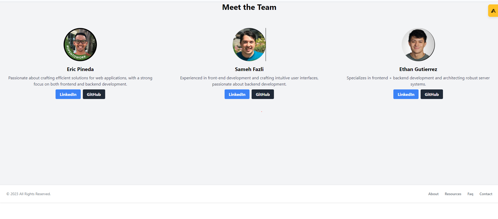
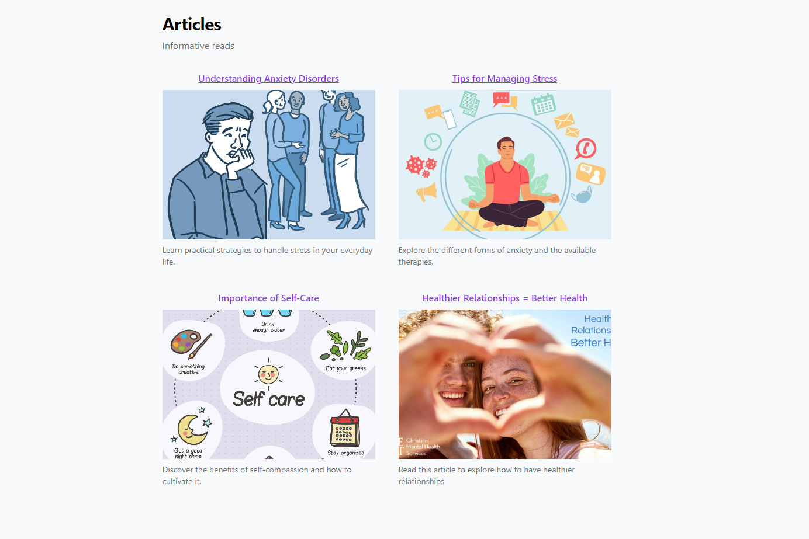
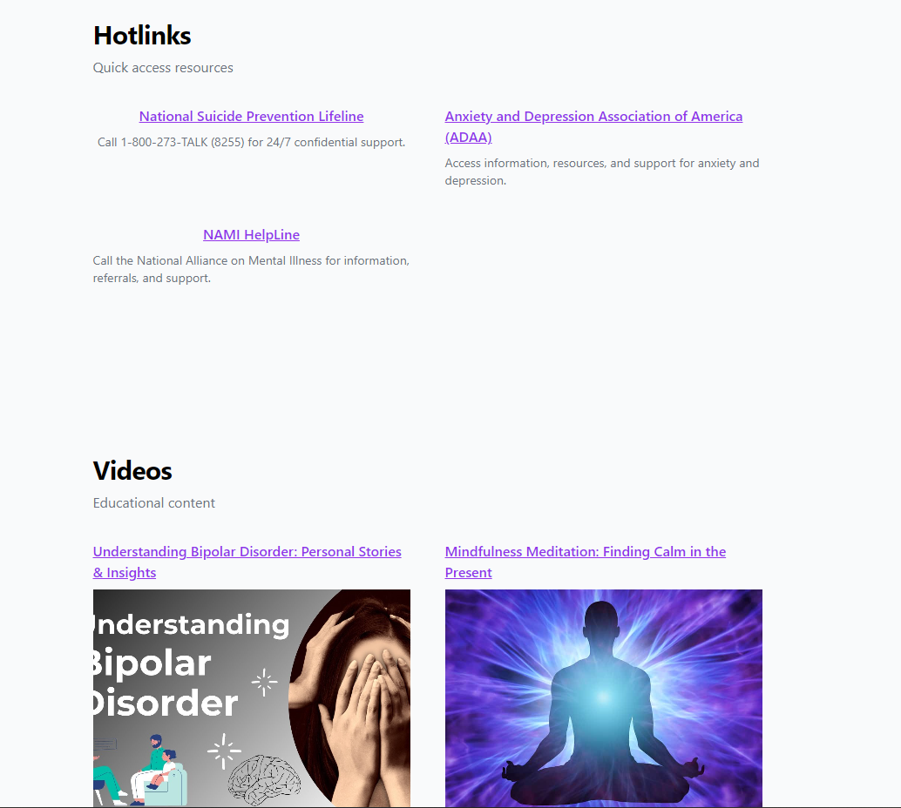
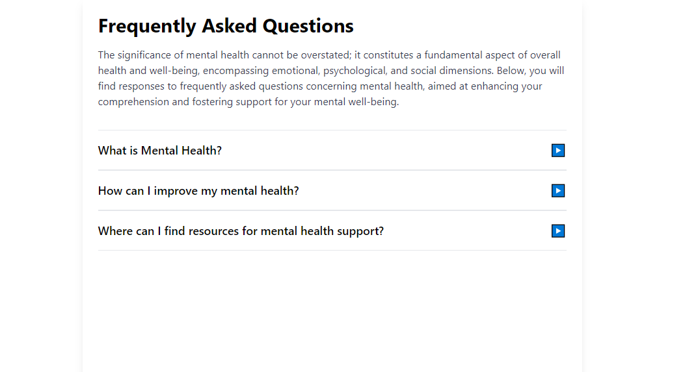
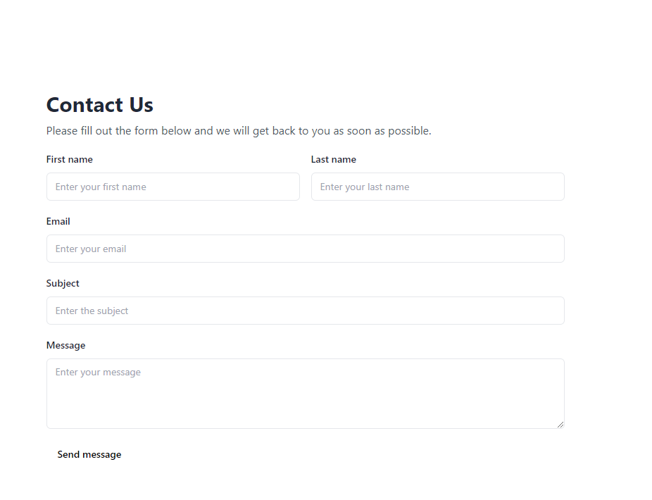
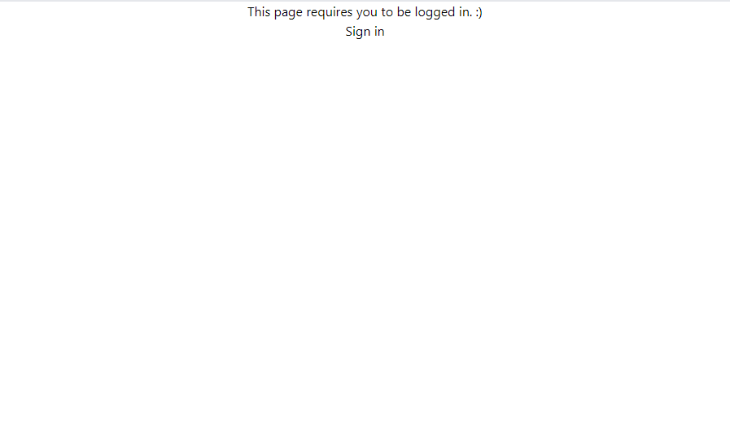
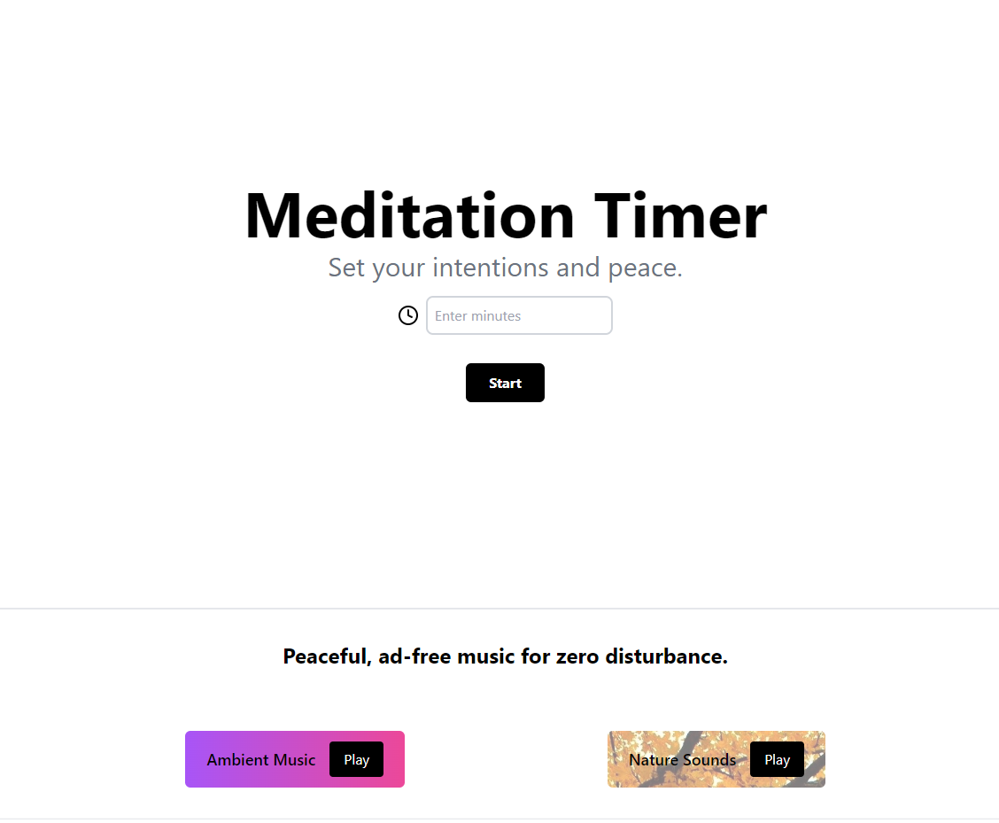

# Mental Wellness Hub

## Live Version:
- To explore the live version of our website, simply follow this link: ```zero-to-one-beta.vercel.app```

## Important Installation
- Please read the Frontend and Backend readme for step-by-step instruction on how to setup the frontend + backend + convex (database). Thank you!
## Technologies used:
- Frontend:
    - ReactJS
    - TailwindCSS
    - Vanilla JavaScript
    - Tip Tap
- Backend:
    - Express
    - Convex (Database)
- Other:
    - NodeJS
    - CSS
    - GitHub Actions (CI/CD)
    - Vercel (Hosting)

## Features:

### Website Pages:
    - Home Page
    - About Page
    - Services Dropdown
        - Meditation Page
        - Resources Page
        - Journal Page
    - Footer
    - Faq Page
    - Contact Us

## Application Features:
- Authentication/Authorization:
- Convex Integration
- Journaling
    - Record and manage journals
- Meditation Timer
    - Track meditation sessions and duration

# Future Features
- AI Bot for Mental Health Support
    - Record and review previous conversations
- Implement Dark-Mode theme for all pages
    - User can be able to switch between light and dark-mode in each page and should stay that mode.

## Backend:
- Routing Configuration
- Convex Configuation

## Team Contributors:
- Frontend:
    - Eric: ReactJS, TailwindCSS, Journal Page
    - Sam: ReactJS, TailwindCSS, Home Page, About Page, Resources, Articles, Contact Us
    - Ethan: ReactJS, TailwindCSS, Meditation Timer Page
- Backend:
    - Ethan: Express, Authentication/Authorization, AI Bot, Routing
    - Eric, Ethan and Sam: Convex Database Integration, Backend Database

## Deployment:
- Hosting Server: Vercel
- CI/CD Pipeline: Github Actions

## Screenshots

### About Us Page:



## Resources Page:




## Faq Page:


## Contact Us Page:


## Meditation page (required to login to see it):


# Example Usage:

## Journaling Feature:
- Users can record their thoughts and feeling ins the journal section.
- They can track their journal entries over time.

## Meditation Timer:
- Users can set a time for their meditation sessions.
- The application tracks the duration of each mediation session.

## AI Bot for Mental Health Support
- Users can engage in conversations with an AI bout about mental health topics.
